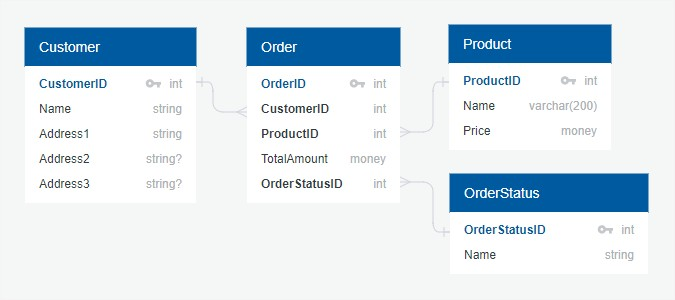

This is an interesting one. Let's take a very standard scenario as an example. Say we have a one-to-many relation (customer-order) between two tables (diagram made using [QuickDBD](https://www.quickdatabasediagrams.com/)):



And say we want to fetch all the customers that haven't made a single order yet. It's sort of the opposite of [filtering by nested entities](/2017/10/22/filtering-entity-collections-with-llblgen-pro-orm/) which was covered in an earlier post of the [series](/2017/10/23/llblgen-pro-tips/). In this case we want to fetch all the customers that have a zero count of children entities. To do this, we'll have to use [JoinHint](https://www.llblgen.com/Documentation/5.3/ReferenceManuals/Designer/html/3988E5B6.htm) and DBNull LLBLGen constructs. Here is how:

```cs
// Fetch all customers with no orders
var customers = new EntityCollection<CustomerEntity>();

var filter = new RelationPredicateBucket();
filter.Relations.Add(CustomerEntity.Relations.OrderEntityUsingCustomerId, JoinHint.Left);
filter.PredicateExpression.Add(OrderFields.OrderId == DBNull.Value);

using(var adapter = new DataAccessAdapter())
{
    adapter.FetchEntityCollection(customers, filter);
}
```

If you have any further questions, please leave them below. Cheers!