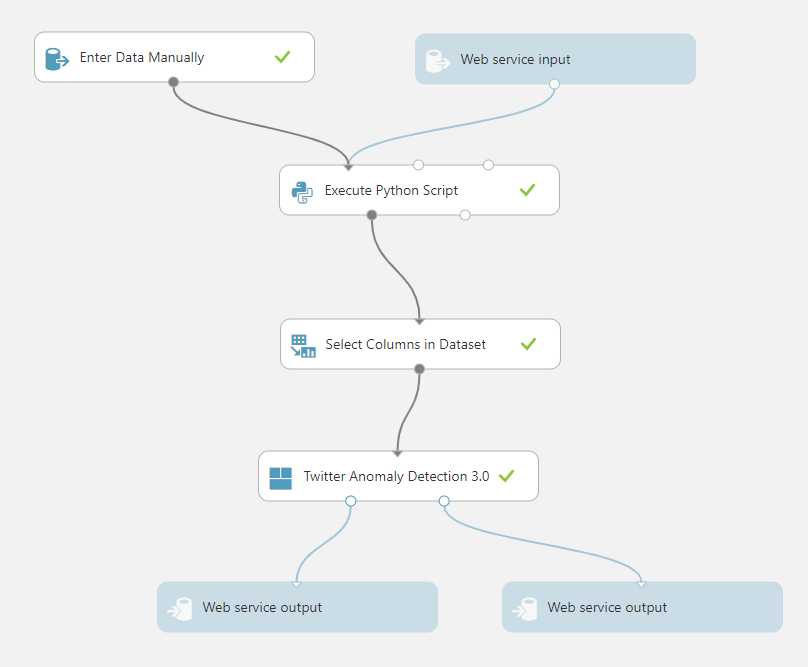
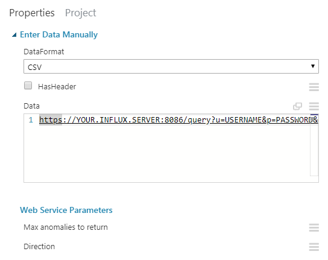
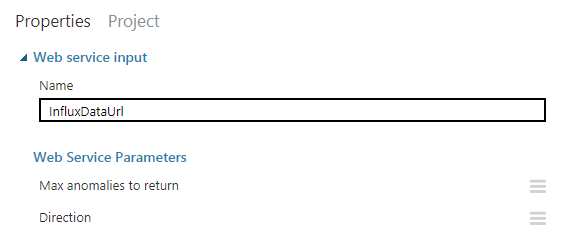
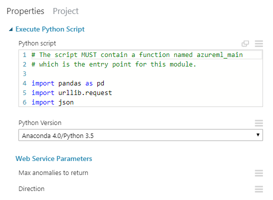
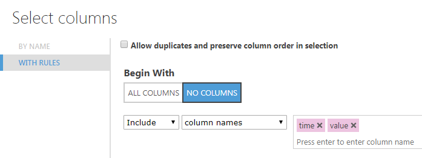
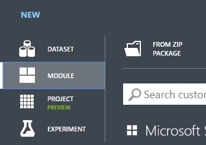
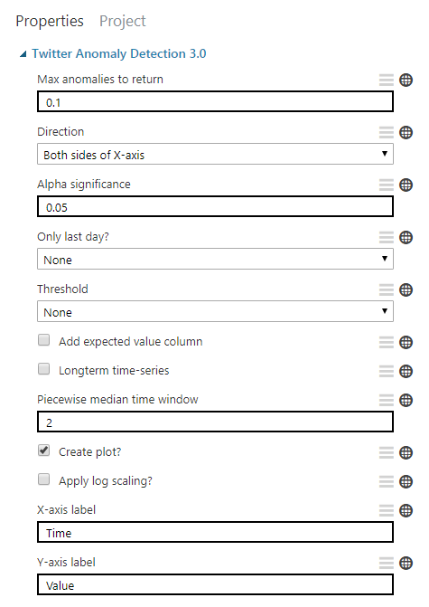
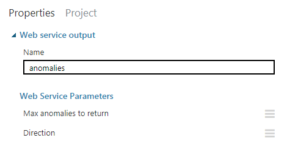
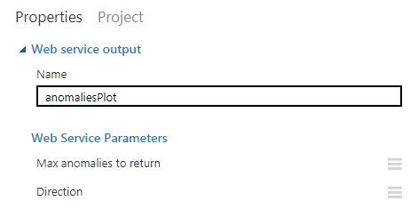

First of all, a massive shout out to [Tej Redkar's](https://www.linkedin.com/in/tejaswiredkar/) and his [Operationalizing Twitter’s Anomaly Detection in AzureML](https://www.linkedin.com/pulse/operationalizing-twitters-anomaly-detection-azureml-tejaswi-redkar/) post which was huge help in figuring out how to make this all work.

First I looked at what kind of anomaly detection libraries even existed and [Twitter's Anomaly Detection](https://anomaly.io/anomaly-detection-twitter-r/) (TAD/AD in the rest of the text) would always bubble up as a winner. There were a few stand-alone libraries and some TAD ports for libraries for C#/.Net, but most of them seemed unmaintained.  The main problem was that the Twitter's library was written in [R](https://github.com/twitter/AnomalyDetection/tree/master/R)... So I looked at how I could potentially run that on Azure and that's when I found Tej's post. I struck gold! Turns out Twitter's library will work fine there and somebody already did it.

After spending some time on it, I finally got it all working. So, why this post then? I felt like certain details could have been explained in more detail to save up some more time. I suppose Tej assumed people would be more familiar with certain things or he simply didn't deem certain details important enough to mention. I will try to go into a little more detail and hopefully between his article and my article, you'll be covered. I also refactored [his R integration](https://github.com/dynamicdeploy/analytics-machinelearning/blob/master/Anomaly%20Detection/R/azureml_ts_anom_detection.R) of TAD and made it a little more clear in terms of variable naming. I also added [InfluxDB](https://www.influxdata.com/) to the mix, which InfluxDB users might find interesting / useful.

I uploaded all the critical pieces of code I used to [GitHub](https://github.com/pootzko/witad). I know it's not the whole .Net solution, but we're probably not using completely the same application architecture. You should be able to take what's there and spread it throughout your application to get the desired end-result.

### General workflow

The general workflow of the solution I implemented looks roughly like this:

- A user lands on the website (SPA) and initializes AD for a certain time range and a set of AD parameter from the UI
- SPA application calls .Net WebAPI and doesn't care how WebAPI handles it all, it just wants an image as a result
- Since the data source that I have, which I want to detect anomalies on comes from InfluxDB, WebAPI should somehow instruct AzureML to fetch the data on its own
  - AD requires a substantial amount of data to process and provide good results, so it wouldn't make sense to pull it all into WebAPI and to then proxy it all the way down to AzureML, that would be a waste of time and resources
  - Since InfluxDB supports REST requests, it made much more sense to just send the request definition to AzureML where the data could be fetched from and to let it fetch it itself
- WebAPI fires up a request against AzureML and as request payload, sends the InfluxDB REST request definition and a set of AD params (which can be used to tweak how AD will work, i.e. to be more or less sensitive during detection etc.)
- AzureML executes the REST request using Python, receives the data in CSV format and then converts it to a format that AzureML will be able to work with
- The next step of the AzureML "experiment" selects the data columns to use
- Data for selected columns gets passed on to the next step - "Twitter Anomaly Detection" (which consists of the Twitter's R library and Tej's R wrapper script)
- Twitter AD crunches the numbers and returns two outputs
  - Result dataset - detected anomalies
  - View port dataset - an image we can embed on our website
- Results get sent back to the WebAPI which in turn sends them back to the browser which then renders the image

This is what my AzureML studio experiment looks like:



### AzureML Experiment steps explained

#### Manual data entry

The first node of the experiment is the _Manual data entry_. You can use it for testing. For example I wanted to simulate the InfluxDB REST request definition that I would be sending in through the _Web service input_. One of the data formats that this node is able to work with is CSV so I simply used the textarea as a plaintext field (I queried it as the first row, and the first column).



InfluxDB allows you to send the database query through URL params. This is what these look like in my case ([I build the URL's in WebAPI](https://github.com/pootzko/witad/blob/master/cs/AnomalyDetectionProvider.cs#L25), depending on the time range and metrics I want to detect anomalies on).

```
https://MY.INFLUX.SERVER:8086/query?u=USERNAME&amp;p=PASSWORD&amp;db=DBNAME&amp;q=select%20time%2C%20Temp%20as%20value%20from%20%22sensor.series%22%20where%20%28SensorId%20%3D%20%270001%27%29%20and%20%28time%20%3E%3D%20%272018-11-01%2000%3A00%3A00%27%20and%20time%20%3C%20%272018-12-01%2000%3A00%3A00%27%29
```

When url-decoded, the query itself looks like this:

```sql
select time, Temp as value from "sensor.series" where (SensorId = '0001') and (time >= '2018-11-01 00:00:00' and time < '2018-12-01 00:00:00')
```

Note how I used the fields `time` and `Temp` but I aliased `Temp` as `value`. This will be significant in the _Select data columns_ step. There are other metrics that I can query from InfluxDB such as Humidity and PM25, but to make it all nice and generic for further experiment nodes, I used the `value` alias here.

#### Web service data input

This one is similar to the _Manual data entry_ except it will accept that InfluxDB URL from the WebAPI and pass it to the next step. This is pretty much what gets called from the WebAPI.

Please see the [code sample](https://github.com/pootzko/witad/blob/master/cs/AnomalyDetectionProvider.cs#L3) for this request on GitHub. Once you've implemented all the nodes, you'll be able to expose the experiment as a web service from inside the Studio, and this is when you'll get the service URL and the API key (in the code sample - these are `AppSettings.AnomaliesServiceUrl` and `AppSettings.AnomaliesAPIKey`, respectively).

Also note the `InfluxDataUrl` value in this screenshot:



It comes from the WebAPI request body, and [here](https://github.com/pootzko/witad/blob/master/cs/AnomalyDetectionRequestBody.cs) you can see the whole payload object in C#. The `Inputs` property contains only a single sub-property (`InfluxDataUrl`) which basically contains our CSV-formatted plaintext InfluxDB request URL. The `GlobalParameters` property are all the variables that _Twitter Anomaly Detection_ can work with. That is how you can dictate how the AD algorithm will work from your WebAPI.

#### REST request using Python

The next node will contain the small [Python script](https://github.com/pootzko/witad/blob/master/py/fetch_influxdb_data.py) which will be used to fetch the data from the InfluxDB server.



The script will read the URL from our "CSV" input, create a request and once it obtains the data from InfluxDB, it will convert it to a format that AzureML can work with. That conversion happens using the [pandas library](https://pandas.pydata.org/) which the AzureML Studio can work with.

Note the last line which expects the columns `time` and `value` described in the previous node.

#### Select data columns

This node takes all the formatted data and lets you chose the columns to work with. Since I only use time and a single metric and since I used the `value` alias for that metric, this step was a no-brainer. I simply had to enter these two column names here and save the changes.



#### Twitter anomaly detection

This is the node that will be executing the actual anomaly detection R code and it was a bit tricky to figure out how to make it work.

First, you'll have to create a custom module:



What goes into the zip file you ask?

- The [module definition XML file](https://github.com/pootzko/witad/blob/master/r/twitteranomalycustommodule.xml) - this is where you can set the module name, version, the entry point script and function, and the anomaly detection parameters such as input fields, dropdowns with their predefined values etc..
- The [entry point R script](https://github.com/pootzko/witad/blob/master/r/azureml_ts_anom_detection.R) - this is the "main" R file that initiates the process of anomaly detection, Tej wrote the initial version of this
- All the remaining R scripts from the [folder](https://github.com/pootzko/witad/tree/master/r) - these actually come from Twitter itself, and it's important to bundle them as well

One thing I didn't get right at start was that I had to manually bundle these Twitter files. For some reason I thought the script would install them via something like nuget or npm. A silly mistake in hindsight, but there you have it.

Now, take all these files, and zip them all together directly from a root folder. Don't "wrap them" in another folder and then zip that folder. That didn't work for me. Zip files only.

Then simply upload the zip and once that's done, a new item will show up in experiment nodes/items inside the "custom" group. You can then drag it to the experiment and wire it up with the previous node. You will be able to change the params manually and these will be your defaults. But, I specify all `GlobalParameters` params on each request to be explicit.



#### Web service output 1 (numeric result dataset)

Once the data is crunched, you will get 2 resulting data sets. This is one of them - the numeric result dataset.



#### Web service output 2 (image result)

This result dataset is the plot (image) that the R script will generate for you. Both of these outputs will be returned as a response to the WebAPI.



### Handling returned results

Let's get back to our WebAPI. The raw response that you'll get will look [like this](https://github.com/pootzko/witad/blob/master/cs/AnomalyDetectionModels.cs#L12). You will probably want to deserialize it and perhaps [adjust](https://github.com/pootzko/witad/blob/master/cs/AnomalyDetectionService.cs#L10) it slightly to make it easier to use.

Once you have that, you can embed the plot image in your client-side app. All you have to do is create an `img` tag with [base64 embedded image](https://stackoverflow.com/a/8499716/413785). Make sure to add `data:image/png;base64,` before adding the string value from the `model.Plot` property.

```html

```

You might also want to conditionally display any potential errors if there are any.

### Conclusion

It took a good few days to put this all together and make it work, but it was a lot of fun and the results are fantastic. It also works reasonably fast. With thousands of data points, we are able to render the AD plot within a few seconds and we've been able to utilize this feature to make extra sense of the data we're harvesting.

Hopefully all this helps you save some time. If something wasn't clear enough, please leave a comment and I'll try to help and update the post. Thanks for reading!